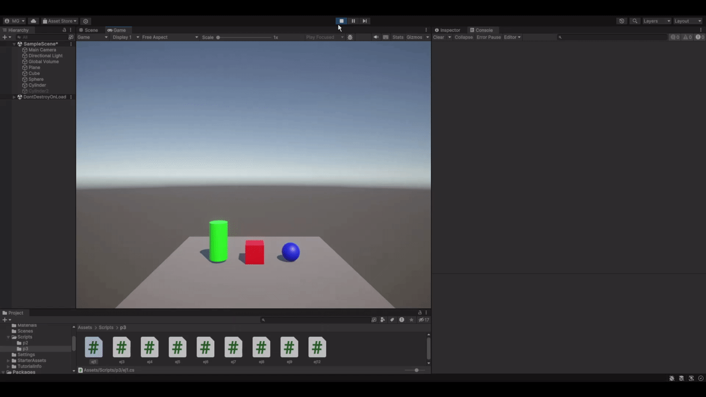
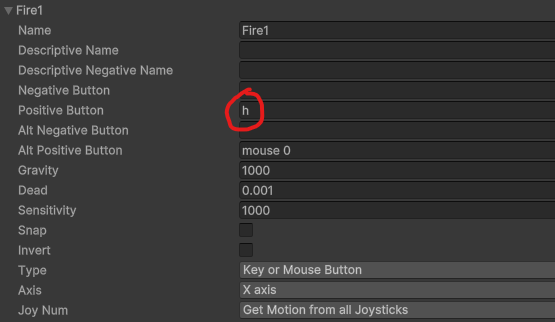
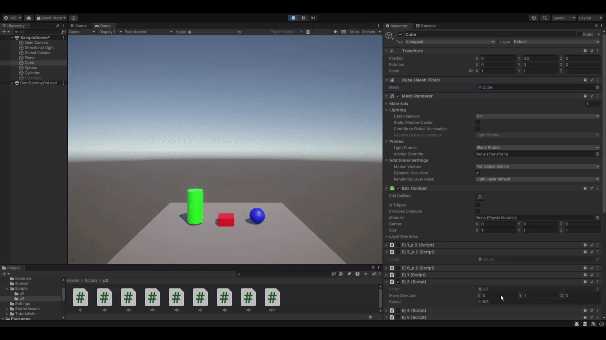
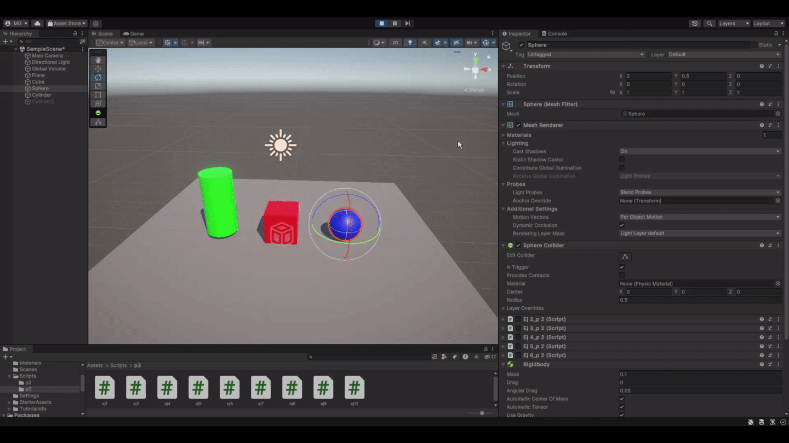
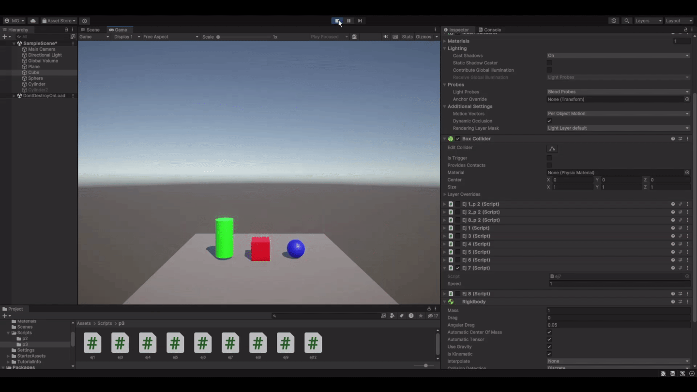
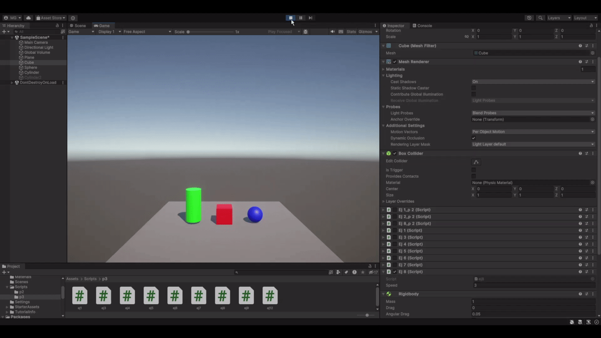

# Interfaces Inteligentes  
## Práctica 3 - Movimiento - Físicas  
  
- Ejercicio 1:  
Se crea una variable de velocidad ligada al cubo y se muestra por consola la velocidad según las distintas direcciones.  
  
  
- Ejercicio 2:  
Se mapea la tecla 'H' a la función disparo  
  
  
- Ejercicio 3:  
Se crea un vector con la dirección de movimiento del cubo y se mueve según la velocidad y la dirección.  
    a. Al duplicar las coordenadas de la dirección del movimiento, el cubo se mueve el doble de rápido.  
    b. Al duplicar la velocidad, el cubo se mueve el doble de rápido.  
    c. Si la velocidad es menor a 1, el cubo se mueve más lento.  
    d. Si el cubo está en una altura mayor o menor la dirección del cubo no cambia.  
    e. Si el sistema de referencia es local, el cubo se mueve según su propia dirección. Si es global, se mueve según la dirección del mundo. Esto es más perceptible si se rota el cubo.  
  
  
- Ejercicio 4:  
Se mueve el cubo con las flechas direccionales. Se crean dos ejes adicionales (horizontal y vertical) en el Input Manager y se mueve la esfera con WASD.  
  
  
- Ejercicio 5:  
Lo mismo que el 4 pero multiplicando la velocidad por Time.deltaTime para que se mueva a la misma velocidad sin depemder de los FPS.  
  
  
- Ejercicio 6:  
Lo mismo que el 5 pero añadiendo movimiento al cubo en dirección a la esfera.  
  
  
- Ejercicio 7:  
Lo mismo que el 6 pero cambiando la dirección a la que apunta el cubo según la posición de la esfera.  
  
  
- Ejercicio 8:  
Se mueve el cubo hacia delante constantemente, cambiando la dirección con las flechas direccionales.  
  
  
- Ejercicios 9, 10, 11:  
Se configura el cilindro como un objeto Trigger, el cubo como un objeto cinemático y la esfera como un objeto físico. Se muestra por consola cuando el cubo o la esfera chocan con el cilindro.  
  
  
- Ejercicio 12:  
Se añade un cilindro distinto al anterior, que se intenta chocar con la bola, a la que se le aplican distintas configuraciones:  
    a. Si se aumenta la masa de la esfera a 10 veces la del cilindro, este apenas puede moverla  
    b. Si se reduce su masa a 1/10 de la del cilindro, este la mueve con facilidad  
    c. Si se establece como cinemática, no se puede mover y el cilindro pasa por encima  
    d. Si se establece como Trigger, se atraviesa la esfera  
